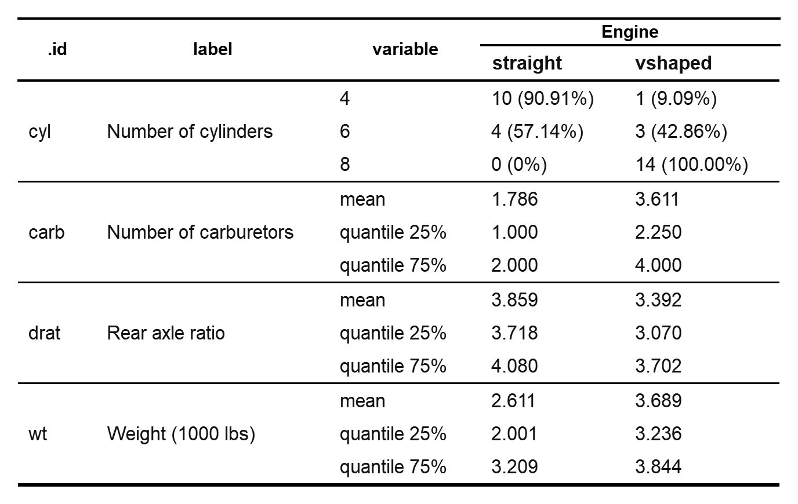
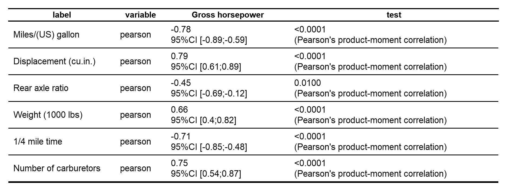
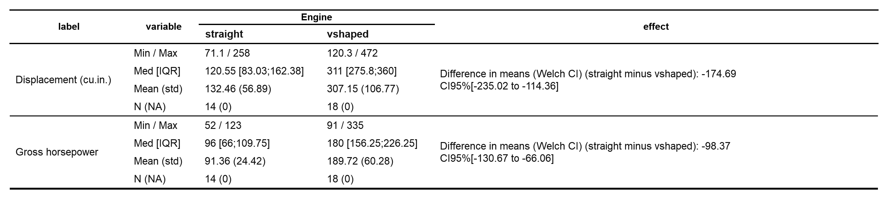
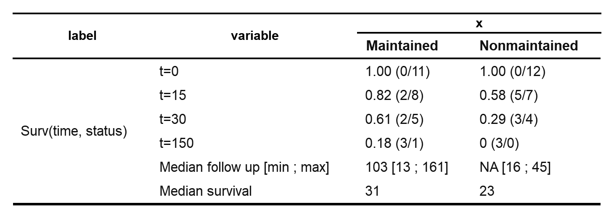

<!-- README.md is generated from README.Rmd. Please edit that file -->

```{r setup, include=FALSE}
knitr::opts_chunk$set(
    collapse=TRUE,
    comment="#>",
    fig.path="man/figures/README-",
    fig.height = 7,
    out.width="100%"
)
# options(Encoding="UTF-8")
library(officer)
library(flextable)
```


# crosstable
<!-- badges: start -->
[](https://CRAN.R-project.org/package=crosstable)
[](https://www.tidyverse.org/lifecycle/#maturing)
[](https://travis-ci.org/DanChaltiel/crosstable)
[](https://codecov.io/gh/DanChaltiel/crosstable?branch=master)
<!-- badges: end -->

Crosstable is a package centered on a single function, `crosstable`, which easily computes descriptive statistics on datasets. It is using the `tidyverse` syntax and is interfaced with the package `officer` to create automatized reports.

## Installation

```{r install, eval=FALSE}
install.packages("devtools")
devtools::install_github("DanChaltiel/crosstable")
```

In case of any installation problem, try reading [the wiki](https://github.com/DanChaltiel/crosstable/wiki/Installation-problems) or fill an [Issue](https://github.com/DanChaltiel/crosstable/issues).

## Getting help

You can use the vignettes: 

+ `vignette("crosstable")` for global use and parameterization 
+ `vignette("crosstable-selection")` for variable selection 
+ `vignette("crosstable-report")` for reporting with `officer` or `Rmarkdown`

These vignettes are reproduced in the [wiki](https://github.com/DanChaltiel/crosstable/wiki). Note that the wiki might be a little less up-to-date than the vignettes.

## Usage

```{r usage0, warning=FALSE, message=FALSE}
library(crosstable)
library(dplyr)

#whole table, with default parameters
crosstable(iris)
```

```{r usage1, eval=TRUE, echo=TRUE, results="hide", warning=FALSE, message=FALSE}
#using the mtcars2 dataset (which has labels) and the `as_flextable` function (for HTML formatting)

#tidyselection, by, custom functions
library(tidyverse)
ct1 = crosstable(mtcars2, ends_with("t"), starts_with("c"), by=vs, 
                 funs=c(mean, quantile), funs_arg=list(probs=c(.25,.75), digits=3)) %>% 
    as_flextable
```

```{r, include=FALSE}
save_as_image(ct1, "man/figures/ct1.png")
```

<p align="center">
  
</p>


```{r usage2, eval=TRUE, echo=TRUE, results="hide", warning=FALSE, message=FALSE}
#margin and totals
ct2 = crosstable(mtcars2, disp, vs, by=am, margin=c("row", "col"), total="both") %>%
    as_flextable
```

```{r, include=FALSE}
save_as_image(ct2, "man/figures/ct2.png")
```

<p align="center">
  
</p>

```{r usage3, eval=TRUE, echo=TRUE, results="hide", warning=FALSE, message=FALSE}
#predicate selection, correlation, testing
ct3 = crosstable(mtcars2, is.numeric, by=hp, test=TRUE)  %>%
    as_flextable
```

```{r, include=FALSE}
save_as_image(ct3, "man/figures/ct3.png")
```

<p align="center">
  
</p>

```{r usage4, eval=TRUE, echo=TRUE, results="hide", warning=FALSE, message=FALSE}
#lambda selection, effect calculation
ct4 = crosstable(mtcars2, ~is.numeric(.x) && mean(.x)>50, by=vs, effect=TRUE)  %>%
    as_flextable
```

```{r, include=FALSE}
save_as_image(ct4, "man/figures/ct4.png")
```

<p align="center">
  
</p>

```{r usage5, eval=TRUE, echo=TRUE, results="hide", warning=FALSE, message=FALSE}
#Survival data (using formula UI)
library(survival)
ct5 = crosstable(aml, Surv(time, status) ~ x,times=c(0,15,30,150), followup=TRUE)  %>%
    as_flextable
```

```{r, include=FALSE}
save_as_image(ct5, "man/figures/ct5.png")
```

<p align="center">
  
</p>


## Acknowledgement

`crosstable` is a rewrite of the awesome [`biostat2` package](https://github.com/eusebe/biostat2) written by David Hajage. The user interface is quite different but the concept is the same.

Thanks David!
