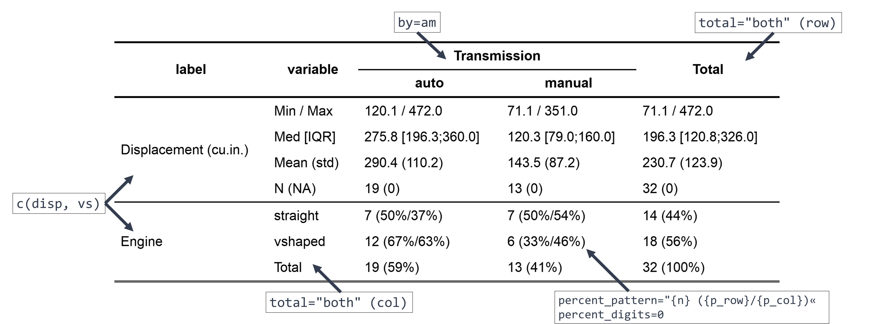
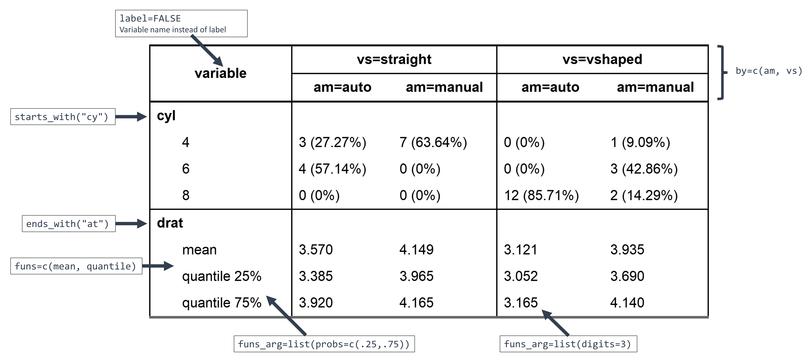

<!-- README.md is generated from README.Rmd. Please edit that file -->

# crosstable <a href='https://DanChaltiel.github.io/crosstable/'></a>

<!-- badges: start -->

[](http://www.gnu.org/licenses/gpl-3.0.html)
[](https://lifecycle.r-lib.org/articles/stages.html)
[](https://CRAN.R-project.org/package=crosstable)
[](https://r-pkg.org/pkg/crosstable)
[](https://github.com/DanChaltiel/crosstable)
[](https://app.codecov.io/gh/DanChaltiel/crosstable?branch=main)
[](https://github.com/DanChaltiel/crosstable/actions/workflows/check-standard.yaml)
[](https://cran.r-project.org/)
<!-- [](https://cran.r-project.org/package=crosstable)  -->
<!-- [](https://travis-ci.org/DanChaltiel/crosstable) -->
<!-- badges: end -->

Crosstable is a package centered on a single function, `crosstable`,
which easily computes descriptive statistics on datasets. It can use the
`tidyverse` syntax and is interfaced with the package `officer` to
create automatized reports.

## Installation

``` r
# Install last version available on CRAN
install.packages("crosstable")

# Install development version on Github
devtools::install_github("DanChaltiel/crosstable@v0.8.1.9007", build_vignettes=TRUE)

# Install specific commit or tagged version (for reproducibility purpose)
devtools::install_github("DanChaltiel/crosstable@v0.8.1.9007", build_vignettes=TRUE)
devtools::install_github("DanChaltiel/crosstable@v0.8.1.9007", build_vignettes=TRUE)
```

Note that, for reproducibility purpose, an even better solution would be
to use [`renv`](https://rstudio.github.io/renv/articles/renv.html).

## Overview

Here are 2 examples to try and show you the main features of
`crosstable`. See the [documentation
website](https://danchaltiel.github.io/crosstable/) for more.

#### Example \#1

> Dear crosstable, using the `mtcars2` dataset, please describe columns
> `disp` and `vs` depending on the levels of column `am`, with totals in
> both rows and columns, and with proportions formatted with group size,
> percent on row and percent on column, with no decimals.

``` r
library(crosstable)
ct1 = crosstable(mtcars2, c(disp, vs), by=am, total="both", 
                 percent_pattern="{n} ({p_row}/{p_col})", percent_digits=0) %>%
  as_flextable()
ct1
```

<p align="center">

</p>

With only a few arguments, we did select which column to describe
(`c(disp, vs)`), define a grouping variable (`by=am`), set the
percentage calculation in row/column (`percent_pattern=`), and ask for
totals (`total=`).

Since `mtcars2` is a dataset with labels, they are displayed instead of
the variable name (see
[here](https://danchaltiel.github.io/crosstable/articles/crosstable.html#dataset-modified-mtcars)
for how to add some).

As `crosstable()` is returning a `data.frame`, we use `as_flextable()`
to output a beautiful HTML table. This one can even be exported to MS
Word with a few more lines of code (see
[here](https://danchaltiel.github.io/crosstable/articles/crosstable-report.html)
to learn how).

#### Example \#2

Here is a more advanced example.

> Dear crosstable, using the `mtcars2` dataset again, please describe
> all columns whose name starts with "cy" and those whose name ends with
> "at", depending on the levels of both columns `am` and `vs`, without
> considering labels, applying `mean()` and `quantile()` as summary
> function, with `probs` 25% and 75% defined for this latter function,
> and with 3 decimals for numeric variables:

``` r
ct2 = crosstable(mtcars2, c(starts_with("cy"), ends_with("at")), by=c(am, vs), 
                 label=FALSE, num_digits=3, funs=c(mean, quantile), 
                 funs_arg=list(probs=c(.25,.75))) %>% 
  as_flextable(compact=TRUE, header_show_n=1:2)
ct2
```

<p style="text-align: center;">

</p>

Here, the variables were selected using `tidyselect` helpers and the
summary functions `mean` and `quantile` were specified, along with
argument `probs` for the latter. Using `label=FALSE` allowed to see
which variables were selected but it is best to keep the labels in the
final table.

In `as_flextable()`, the `compact=TRUE` option yields a longer output,
which may be more suited in some contexts (for instance for
publication), and `header_show_n=1:2` adds the group sizes for both rows
of the header.

## Documentation

You can find the whole documentation on the [dedicated
website](https://danchaltiel.github.io/crosstable/):

- `vignette("crosstable")` for a first step-by-step guide on how to use
  `crosstable`
  ([link](https://danchaltiel.github.io/crosstable/articles/crosstable.html))
- `vignette("crosstable-report")` for more on creating MS Word reports
  using either `{officer}` or `Rmarkdown`
  ([link](https://danchaltiel.github.io/crosstable/articles/crosstable-report.html))
- `vignette("pertent_pattern")` for more on how to use `percent_pattern`
  ([link](https://danchaltiel.github.io/crosstable/articles/crosstable-selection.html))
- `vignette("crosstable-selection")` for more on variable selection
  ([link](https://danchaltiel.github.io/crosstable/articles/crosstable-selection.html)),
  although you should better read
  <https://tidyselect.r-lib.org/articles/syntax.html>.

There are lots of other features you can learn about there, for instance
(non-exhaustive list):

- description of correlation, dates, and survival data
  ([link](https://danchaltiel.github.io/crosstable/articles/crosstable.html#miscellaneous-1))
- variable selection with functions, e.g. `is.numeric`
  ([link](https://danchaltiel.github.io/crosstable/articles/crosstable-selection.html#select-with-predicate-functions))
- formula interface, allowing to describe more mutated columns,
  e.g. `sqrt(mpg)` or `Surv(time, event)`
  ([link](https://danchaltiel.github.io/crosstable/articles/crosstable-selection.html#select-with-a-formula))
- automatic computation of statistical tests
  ([link](https://danchaltiel.github.io/crosstable/articles/crosstable.html#tests))
  and of effect sizes
  ([link](https://danchaltiel.github.io/crosstable/articles/crosstable.html#effects))
- global options to avoid repeating arguments
  ([link](https://danchaltiel.github.io/crosstable/reference/crosstable_options.html))

## Getting help and giving feedback

If you have a question about how to use `crosstable`, please ask on
[StackOverflow](https://stackoverflow.com/) with the tag `crosstable`.
You can `@DanChaltiel` in a comment if you are struggling to get
answers. Don't forget to add a minimal **repr**oducible **ex**ample to
your question, ideally using the [reprex](https://reprex.tidyverse.org/)
package.

If you miss any feature that you think would belong in `crosstable`,
please fill a [Feature
Request](https://github.com/DanChaltiel/crosstable/issues/new/choose)
issue.

If you encounter an unexpected error while using `crosstable`, please
fill a [Bug
Report](https://github.com/DanChaltiel/crosstable/issues/new/choose)
issue. In case of any installation problem, try the solutions proposed
in [this
article](https://danchaltiel.github.io/crosstable/articles/crosstable-install.html)
first.

## Acknowledgement

In its earliest development phase, `crosstable` was based on the awesome
package [`biostat2`](https://github.com/eusebe/biostat2) written by
David Hajage. Thanks David!
