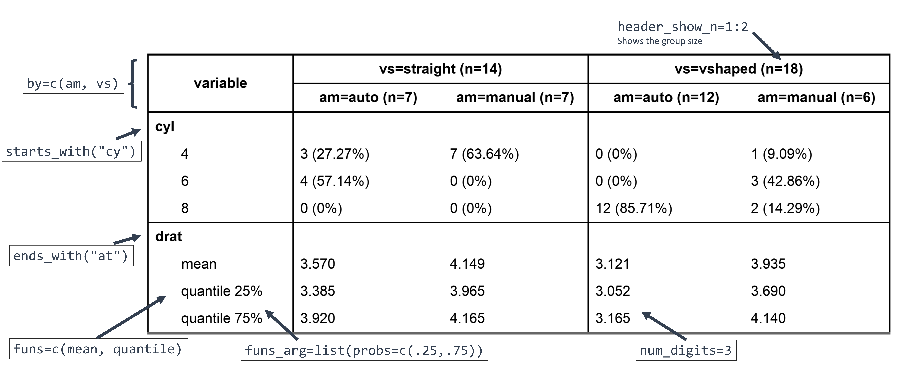

# crosstable

Crosstable is a package centered on a single function, `crosstable`,
which easily computes descriptive statistics on datasets. It can use the
`tidyverse` syntax and is interfaced with the package `officer` to
create automatized reports.

## Installation

``` r
# Install last version available on CRAN
install.packages("crosstable")

# Install development version on Github
remotes::install_github("DanChaltiel/crosstable@v0.8.2.9001")
```

Note that, for reproducibility purpose, an even better solution would be
to use [`renv`](https://rstudio.github.io/renv/articles/renv.html).

## Overview

Here are 2 examples to try and show you the main features of
`crosstable`. See the [documentation
website](https://danchaltiel.github.io/crosstable/) for more.

#### Example \#1

> Dear crosstable, using the `mtcars2` dataset, please describe columns
> `disp` and `vs` depending on the levels of column `am`, with totals in
> both rows and columns, and with proportions formatted with group size,
> percent on row and percent on column, with no decimals.

``` r
library(crosstable)
ct1 = crosstable(mtcars2, c(disp, vs), by=am, total="both", 
                 percent_pattern="{n} ({p_row}/{p_col})", percent_digits=0) %>%
  as_flextable()
ct1
```


With only a few arguments, we did select which column to describe
(`c(disp, vs)`), define a grouping variable (`by=am`), set the
percentage calculation in row/column (`percent_pattern=`), and ask for
totals (`total=`).

Since `mtcars2` is a dataset with labels, they are displayed instead of
the variable name (see
[here](https://danchaltiel.github.io/crosstable/articles/crosstable.html#dataset-modified-mtcars)
for how to add some).

As
[`crosstable()`](https://danchaltiel.github.io/crosstable/reference/crosstable.md)
is returning a `data.frame`, we use
[`as_flextable()`](https://danchaltiel.github.io/crosstable/reference/as_flextable.md)
to output a beautiful HTML table. This one can even be exported to MS
Word with a few more lines of code (see
[here](https://danchaltiel.github.io/crosstable/articles/crosstable-report.html)
to learn how).

#### Example \#2

Here is a more advanced example.

> Dear crosstable, using the `mtcars2` dataset again, please describe
> all columns whose name starts with “cy” and those whose name ends with
> “at”, depending on the levels of both columns `am` and `vs`, without
> considering labels, applying
> [`mean()`](https://rdrr.io/r/base/mean.html) and
> [`quantile()`](https://rdrr.io/r/stats/quantile.html) as summary
> function, with `probs` 25% and 75% defined for this latter function,
> and with 3 decimals for numeric variables:

``` r
ct2 = crosstable(mtcars2, c(starts_with("cy"), ends_with("at")), by=c(am, vs), 
                 label=FALSE, num_digits=3, funs=c(mean, quantile), 
                 funs_arg=list(probs=c(.25,.75))) %>% 
  as_flextable(compact=TRUE, header_show_n=1:2)
ct2
```



Here, the variables were selected using `tidyselect` helpers and the
summary functions `mean` and `quantile` were specified, along with
argument `probs` for the latter. Using `label=FALSE` allowed to see
which variables were selected but it is best to keep the labels in the
final table.

In
[`as_flextable()`](https://danchaltiel.github.io/crosstable/reference/as_flextable.md),
the `compact=TRUE` option yields a longer output, which may be more
suited in some contexts (for instance for publication), and
`header_show_n=1:2` adds the group sizes for both rows of the header.

## Documentation

You can find the whole documentation on the [dedicated
website](https://danchaltiel.github.io/crosstable/):

- [`vignette("crosstable")`](https://danchaltiel.github.io/crosstable/articles/crosstable.md)
  for a first step-by-step guide on how to use `crosstable`
  ([link](https://danchaltiel.github.io/crosstable/articles/crosstable.html))
- [`vignette("crosstable-report")`](https://danchaltiel.github.io/crosstable/articles/crosstable-report.md)
  for more on creating MS Word reports using either
  [officer](https://ardata-fr.github.io/officeverse/) or `Rmarkdown`
  ([link](https://danchaltiel.github.io/crosstable/articles/crosstable-report.html))
- `vignette("pertent_pattern")` for more on how to use `percent_pattern`
  ([link](https://danchaltiel.github.io/crosstable/articles/crosstable-selection.html))
- [`vignette("crosstable-selection")`](https://danchaltiel.github.io/crosstable/articles/crosstable-selection.md)
  for more on variable selection
  ([link](https://danchaltiel.github.io/crosstable/articles/crosstable-selection.html)),
  although you should better read
  <https://tidyselect.r-lib.org/articles/syntax.html>.

There are lots of other features you can learn about there, for instance
(non-exhaustive list):

- description of correlation, dates, and survival data
  ([link](https://danchaltiel.github.io/crosstable/articles/crosstable.html#miscellaneous-1))
- variable selection with functions, e.g. `is.numeric`
  ([link](https://danchaltiel.github.io/crosstable/articles/crosstable-selection.html#select-with-predicate-functions))
- formula interface, allowing to describe more mutated columns,
  e.g. `sqrt(mpg)` or `Surv(time, event)`
  ([link](https://danchaltiel.github.io/crosstable/articles/crosstable-selection.html#select-with-a-formula))
- automatic computation of statistical tests
  ([link](https://danchaltiel.github.io/crosstable/articles/crosstable.html#tests))
  and of effect sizes
  ([link](https://danchaltiel.github.io/crosstable/articles/crosstable.html#effects))
- global options to avoid repeating arguments
  ([link](https://danchaltiel.github.io/crosstable/reference/crosstable_options.html))

## Getting help and giving feedback

If you have a question about how to use `crosstable`, please ask on
[StackOverflow](https://stackoverflow.com/) with the tag `crosstable`.
You can `@DanChaltiel` in a comment if you are struggling to get
answers. Don’t forget to add a minimal **repr**oducible **ex**ample to
your question, ideally using the [reprex](https://reprex.tidyverse.org/)
package.

If you miss any feature that you think would belong in `crosstable`,
please fill a [Feature
Request](https://github.com/DanChaltiel/crosstable/issues/new/choose)
issue.

If you encounter an unexpected error while using `crosstable`, please
fill a [Bug
Report](https://github.com/DanChaltiel/crosstable/issues/new/choose)
issue. In case of any installation problem, try the solutions proposed
in [this
article](https://danchaltiel.github.io/crosstable/articles/crosstable-install.html)
first.

## Acknowledgement

In its earliest development phase, `crosstable` was based on the awesome
package [`biostat2`](https://github.com/eusebe/biostat2) written by
David Hajage. Thanks David!
