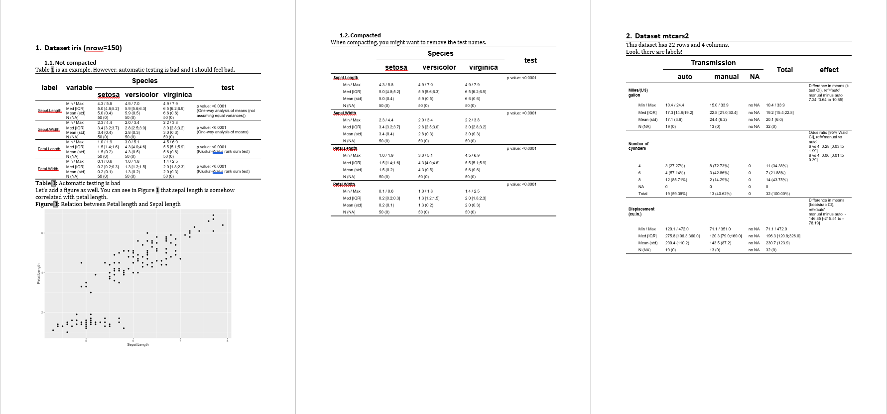

```{r init, include = FALSE}
knitr::opts_chunk$set(
  collapse = TRUE,
  comment = "#>"
)
old = options(width = 100, 
              crosstable_verbosity_autotesting="quiet")
library(crosstable)
library(dplyr)
```


Being inserted in automatic reporting is the ultimate goal of crosstables.

There are two cases to consider:

 * You have a lot of tables and little text? You probably should use [officer](#create-reports-with-officer).
 * You have a lot of text and a few tables? You probably should use [Rmarkdown](#create-reports-with-rmarkdown).

## Create reports with `officer`

The real power of `crosstable` comes out when used with David Gohel's awesome package [`officer` ](https://davidgohel.github.io/officer/), which allows to automatically create MS Word documents. 

For instance, let's try to create a document like this: 


You can also download this example [here](https://github.com/DanChaltiel/crosstable/raw/main/examples/vignette_officer.docx).

### Code

This code will produce the example above.

First, we create 3 crosstables using available datasets, along with a ggplot. Then, we start a document (using `officer::read_docx()`), add some titles and paragraphs, incorporate our tables and our plot, along with legends, and add some page breaks. Note that the legends have a `bookmark` argument that can be referred to in the text for automatic numbering.

```{r officer, message=FALSE, warning=FALSE}
library(officer)
library(ggplot2)

ct1=crosstable(iris, by=Species, test=TRUE)
ct2=crosstable(mtcars2, c(mpg,cyl,disp), by=am, effect=TRUE, 
               total="both", showNA="always")
ct3=crosstable(esoph)
crosstable_options(
  crosstable_fontsize_body=8,
  crosstable_padding_v=0,
  crosstable_units="cm"
)
my_plot = ggplot(data = iris ) +
  geom_point(mapping = aes(Sepal.Length, Petal.Length))

doc = read_docx() %>% #default template
  body_add_title("Dataset iris (nrow={nrow(iris)})", 1) %>%
  body_add_title("Not compacted", 2) %>%
  body_add_normal("Table \\@ref(table_autotest) is an example. However, automatic 
                  testing is bad and I should feel bad.") %>%
  body_add_crosstable(ct1) %>%
  body_add_table_legend("Automatic testing is bad", bookmark="table_autotest") %>%
  body_add_normal() %>%  
  body_add_normal("Let's add a figure as well. <br> You can see in Figure \\@ref(fig_iris) 
                  that sepal length is somehow correlated with petal length.") %>%
  body_add_figure_legend("Relation between Petal length and Sepal length", 
                         bookmark="fig_iris") %>% 
  body_add_gg2(my_plot, w=14, h=10, scale=1.5) %>% 
  body_add_break() %>%
  
  body_add_title("Compacted", 2) %>%
  body_add_normal("When compacting, you might want to remove the test names.") %>%
  body_add_crosstable(ct1, compact=TRUE, show_test_name=FALSE) %>%
  body_add_break() %>%
  
  body_add_title("Dataset mtcars2", 1) %>%
  body_add_normal("This dataset has {nrow(ct3)} rows and {x} columns.", 
                  x=ncol(ct3)) %>%
  body_add_normal("Look, there are labels!") %>%
  body_add_crosstable(ct2, compact=TRUE)
```

For demonstration purposes, I tried to cover as many features as possible, so it contains multiple syntaxes for the same result. Of course, you should use whatever syntax you are most comfortable with.

You can find other useful functions in the [references](https://danchaltiel.github.io/crosstable/reference/index.html#section-officer-helpers).

### Output

```{r save, include=FALSE}
if(file.exists("../examples")){
  print(doc, "../examples/vignette_officer.docx")
  print(doc, "../man/figures/vignette_officer.docx")
  # print(doc, "../docs/articles/vignette_officer.docx")
}
```

To see the resulting Word document, use:

```{r print, eval=FALSE}
write_and_open(doc, "vignette_officer.docx")
```

While you are still working on your code, you might want to omit the name so that you open the docx file in a temporary file for a quick peek (`write_and_open(doc)`). This will prevent the errors that happen when the file is already open. 


You can also use `print(doc, "vignette_officer.docx")` if you don't want the file to open right away.

### Functions

Here is a brief description of the functions used in this example:

 + `officer::read_docx()`: creates a bare MS Word document
 + `body_add_title()`: adds a title paragraph of any level
 + `body_add_normal()`: adds a normal style paragraph. You can also incorporate variables using the syntax `{nrow(ct3)}` and references using the syntax `\\@ref(my_bookmark)`.
 + `body_add_crosstable()`: adds a crosstable
 + `body_add_figure_legend()` and `body_add_table_legend()`: adds a figure/table legend. The `bookmark` is the key that can be added elsewhere in `body_add_normal()`.
 + `body_add_gg2()`: adds a ggplot. Unlike `officer::body_add_gg()`, you can change the unit using the `units` argument or the options `options(crosstable_units="cm")`.

Browse https://davidgohel.github.io/officer/ for more insight about how you can use `{officer}`.


### Autofit macro for large tables

This is great, but large tables will unfortunately overflow your document.

This is a ([known](https://ardata-fr.github.io/officeverse/faq.html#update-fields)) limitation that cannot be fixed using `R`.

You would have to use MS Word autofit tools on each table one by one (`Table Tools > Layout > AutoFit > AutoFit Window`), which can be really tedious.

But fear not! You can use a MS Word macro to do the job for you. Here is how:

* In the R console, run `generate_autofit_macro()` to generate the file `crosstable_autofit.bas` in your working directory.

* In MS Word, press <kbd>Alt</kbd>+<kbd>F11</kbd> to open the VB Editor.

* In the Editor, go to `File` > `Import` or press `Ctrl+M` to open the import dialog, and import `crosstable_autofit.bas`. There should now be a "CrosstableMacros" module in the "Normal" project.
* Run the macro, either from the VB Editor or from `View` > `Macros` > `View Macros` > `Run`.
  
This process will make the macro accessible from any Word file on this computer. Note that, in the Editor, you can also drag the module to your document project to make the macro accessible only from this file. The file will have to be named with the `docm` extension though.

### Styles

Crosstables uses [Word styles](https://support.microsoft.com/fr-fr/office/personnaliser-ou-cr%C3%A9er-des-styles-d38d6e47-f6fc-48eb-a607-1eb120dec563) to operate at full power .

Here, I used the default template of `officer::read_docx()` that comes with default styles. In your own custom template, you can edit all styles (for instance you can make "Normal" have a bold font of size 8) and add your own.

The best example here is `body_add_list()`, which is supposed to add a bullet list. Unfortunately, the default template does not come with list styles so you will have to add one to your custom template before using it:

```r
doc = read_docx("my_template.docx) %>% #your custom template
  body_add_list(c("this is item 1", "this is item 2"), style="bullet")

#alternatively, you can define the style globally and use the ordered parameter
options(crosstable_style_list_unordered="bullet")
options(crosstable_style_list_ordered="numbered")
doc = read_docx("my_template.docx) %>%
  body_add_list(c("this is item 1", "this is item 2"), ordered=FALSE)
```

See `?crosstable_options` for a list of all styles you can specify globally and use `officer::styles_info(doc)` to see which one are available in your template.

Note that you might sometimes encounter the error "Error: could not match any style named 'xxx'" if you are not careful.

### Post-production for table/figure legends

Depending on your version of `{officer}`, Word will ask you to update the fields

 + During the opening of the document, MS Word might ask you to "update the fields", to which you should answer "Yes". 
If it does not ask or if you answer "No", the legends added with `body_add_table_legend()` or `body_add_figure_legend()` might have no actual numbers displayed.   
In this case, you have to manually update the references inside MS Word: select all (\kbd{Ctrl}+\kbd{A}), then update (\kbd{F9}), sometimes twice. You might even need to do this several times. See `?body_add_legend` for more insight.

 + Be aware that you unfortunately cannot reference a bookmark more than once using this method. Writing: 
`body_add_normal("Table \\@ref(iris_col1) is about flowers. I like this Table \\@ref(iris_col1).")` will prevent **all** the numbering from applying.


## Create reports with `Rmarkdown`

<!-- Integration Rmd in Rmd: la coloration syntaxique RStudio est mauvaise mais le code est bon ! -->
<!-- https://stackoverflow.com/questions/53226493/add-markdown-code-chunk-to-r-markdown-document#comment104859956_53226493 -->
Knitting (`knitr::knit()` or via **RStudio**) this `Rmd` code also creates a MS-Word file. Here, you can use the power of `bookdown` to generate the automatic numbering of the tables.


````markdown

---
title: "Iris"
output: bookdown::word_document2
---
    
`r ''````{r setup, include=FALSE}
library(crosstable)
library(flextable)
```

Table iris is given in Table \@ref(tab:irisTable).

`r ''````{r description, echo=FALSE, results='asis'}
cat("<caption> (\\#tab:irisTable) Table Iris </caption> \n\r ")
crosstable(iris, Sepal.Length, Sepal.Width, by=Species, test = TRUE, total="column") %>% as_flextable
```

````

You can example files here: [vignette_markdown.Rmd](../examples/vignette_markdown.Rmd) and [vignette_markdown.docx](../examples/vignette_markdown.docx).

I have to admit that I don't use Rmarkdown a lot with `crosstable`, so this feature might not be as maintained as others.

```{r, include = FALSE}
options(old)
```
